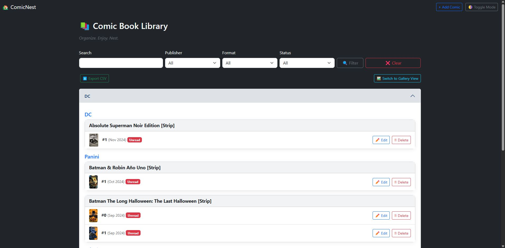
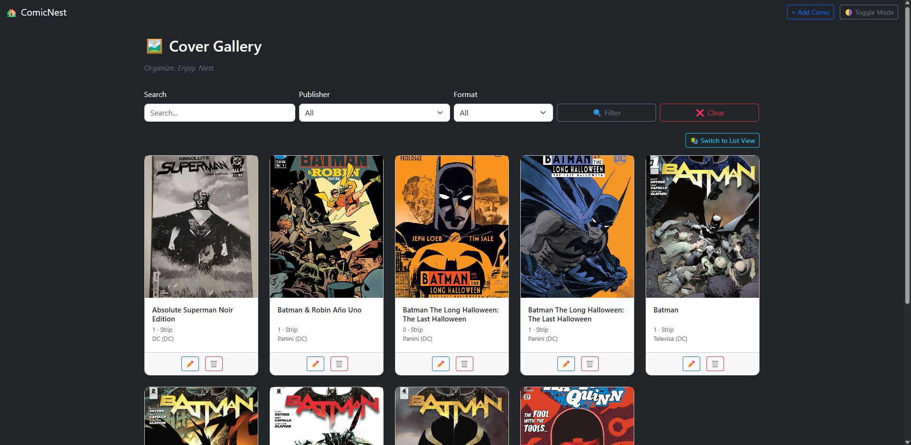
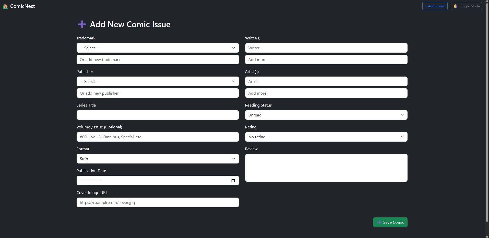
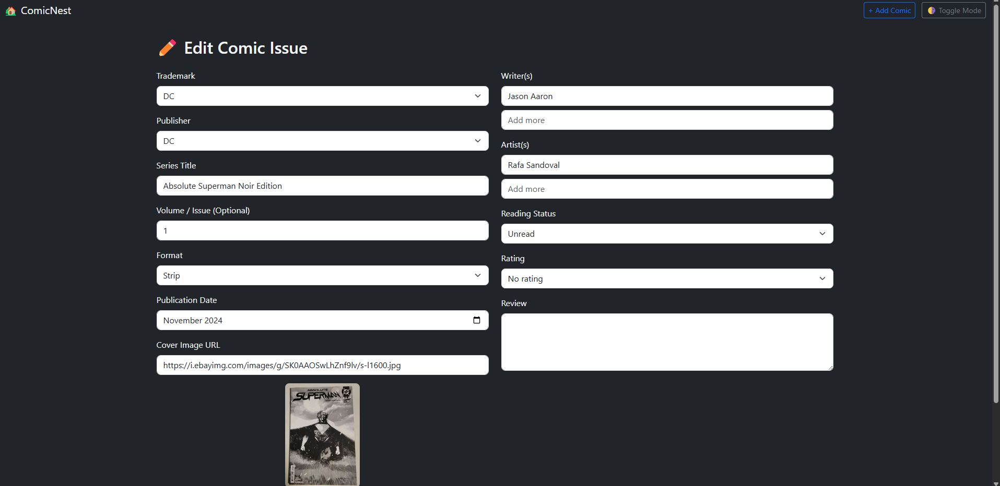

# 🏡 ComicNest
## V 1

**Your personal comic book library manager** — built with PHP, PostgreSQL, Bootstrap, and a ton of love for comics.  
ComicNest lets you **organize, filter, and admire your collection** like never before.

> **Tagline:** _Organize. Enjoy. Nest._

---

## ✨ Features

- 📚 Organize by Trademark → Publisher → Series → Issue
- 🔍 Powerful search + filter by publisher, format, or reading status
- 🖼️ Cover previews via URL (live image support)
- 🌓 Dark mode toggle (with memory)
- 🔄 Toggle between list and gallery views
- ⭐ Rate issues and write reviews
- 💬 Writers, artists, notes — all tracked
- 📥 Export to CSV with one click
- 🎯 Clean UI with Bootstrap 5.3.5 styling

---

## 🖼️ Screenshots

<p align="center">
  
</p>

<p align="center">
  
</p>

<p align="center">
  
</p>

<p align="center">
  
</p>

---

## 🛠 Tech Stack

- **Backend:** PHP (Vanilla)
- **Database:** PostgreSQL
- **UI Framework:** Bootstrap 5.3.5
- **Local Dev:** Laragon
- **Dark Mode:** CSS + localStorage toggle
- **Export:** Native CSV generator

---

## 🚀 Getting Started

### 1. Clone the Repo

```bash
git clone https://github.com/Verttungas/comicnest.git
cd comicnest
```

### 2. Configure `.env`

Create your `.env` file in the root:

```env
DB_HOST=localhost
DB_PORT=5432
DB_NAME=comicnest
DB_USER=your_pg_user
DB_PASS=your_pg_password
```

### 3. Set Up the Database

```bash
psql -U your_pg_user -d comicnest -f database/schema.sql
```

(Optional) Load sample data:

```bash
psql -U your_pg_user -d comicnest -f database/sample_data.sql
```

### 4. Run Locally

If using Laragon, access the app via:

```
http://localhost/comicnest/public/index.php
```

---

## 📁 Project Structure

```
comicnest/
├── public/         → App entry points (index, edit, etc.)
├── includes/       → Shared layout + logic (header, footer, functions)
├── templates/      → Reusable form structure
├── assets/
│   └── css/        → Custom styling
│   └── img/        → Screenshots, logos
├── database/       → schema.sql and optional seed data
├── config/         → db.php, .env loading
└── .env            → Environment secrets (not included in repo)
```

---

## 💡 Roadmap Ideas

- 📊 Reading stats dashboard
- 📱 Responsive mobile view
- 🧠 Smart series/issue linking
- 🔐 Optional login support
- 🪄 Add comic via barcode / ISBN

---

## 🧠 Philosophy

ComicNest is lightweight and self-hosted — designed for collectors and comic lovers who want **control** of their library, offline or online.

No bloated CMS. No frameworks. Just simple PHP, Bootstrap, and pure organizing joy.

---

## 📄 License

MIT License — free to use, remix, fork, and share.

---

## 🧙‍♂️ Created By

**[@verttungas](https://github.com/verttungas)**  
Made with 💬, 📚, and a lot of ADHD.  
Pull requests, forks, and stars welcome ⭐

---

> _“With great comics, comes great organizing.” — ComicNest_
